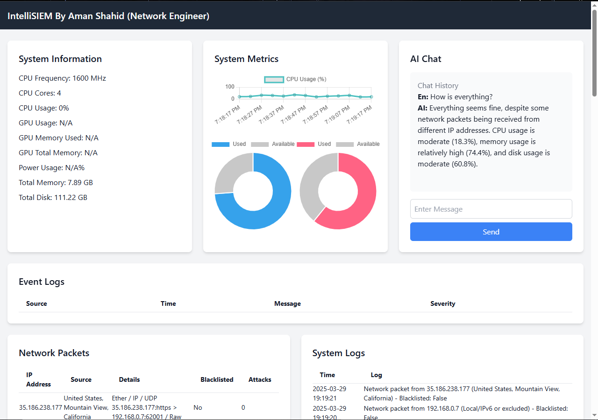

In my latest project, I developed an **AI-powered, real-time Security Information and Event Management (SIEM) system**. Leveraging **Convolutional Neural Networks (CNN)**, **Natural Language Processing (NLP)**, and advanced infrastructure components, this system provides a robust security solution that detects, analyzes, and responds to threats in real-time.

**Technologies & Highlights:**
- **Machine Learning & AI Models**: A CNN-based Intrusion Detection System (IDS) for detecting and classifying network packets.
- **NLP-Powered Alerts**: Automated, concise notifications and alarms that provide clear insights into security statuses.
- **Real-Time Monitoring**: System metrics (CPU, RAM, GPU), network packets, and event logs are monitored and visualized on a modern dashboard built with Tailwind, Chart.js, Flask, and Socket.IO.
- **Database Integration for Logging and Analysis**: Logs, network data, and system metrics are stored for analysis and traceability.
- **Gemini API Integration**: Advanced AI-powered analysis and advisory services using Gemini’s powerful processing capabilities, analyzing live data and network logs for improved threat detection and response.

**Project UI**:
The **dynamic dashboard** enables real-time monitoring of system metrics, logs, and network events. CPU, memory, and disk usage are displayed through live charts, while AI-generated alerts are visible in a dedicated chat area. Flask SocketIO is used to stream live data to the client, supporting continuous monitoring.

**Objective & Benefits**:
This project aims to support organizations with real-time threat detection, providing both automated responses and actionable insights through an AI-driven SIEM operator. The system is ideal for security-sensitive environments, where proactive response to cyber threats is critical. **Gemini integration** further enhances analysis speed and decision-making, making this SIEM solution a powerful tool in cybersecurity operations.


# AI-Driven SIEM Realtime Operator with Gemini Integration

## Overview
This project is an AI-powered Security Information and Event Management (SIEM) system designed for real-time threat detection and response. Using Convolutional Neural Networks (CNN), Natural Language Processing (NLP), and the Gemini API, this system can monitor, analyze, and provide actionable insights on system performance, logs, and network data in real time.

## Key Features
- **Intrusion Detection**: Uses a CNN-based model to detect and classify network packets as either suspicious or normal.
- **Gemini Integration**: Leverages the Gemini API for high-performance analysis and AI-driven decision-making, delivering enhanced threat detection capabilities.
- **Real-Time System Metrics**: Monitors CPU, RAM, GPU usage, and more, displaying metrics on a live dashboard.
- **NLP-Powered Alerts**: Provides concise, actionable alerts based on system events and threat levels.
- **WebSocket Support**: Real-time data streaming to the client using Flask and Socket.IO.
- **Database Integration**: Stores logs, network requests, and system metrics in a SQLite database for traceability.

## Installation

1. **Clone the repository**:
   ```bash
   git clone https://github.com/dev-sire/Intellisiem.git
   cd AI-Driven-SIEM-Operator
   ```

2. **Install dependencies**:
   ```bash
   pip install -r requirements.txt
   Install Ollama and Llama3.2
   ```

3. **Configure Gemini API**:
   - Add your Gemini API key to `config.py`:
   ```python
   GEMINI_API_KEY = "your_gemini_api_key"
   ```

4. **Run the application**:
   ```bash
   python app_gemini.py
   ```

## Usage

- **Access the dashboard**: Navigate to `http://localhost:5000` to view system metrics, logs, and network data.
- **Real-time monitoring**: Receive live metrics, network activity, and AI-generated alerts in real-time.
- **Customizable API**: Integrate with Gemini to leverage high-performance AI analysis.

## License
This project is licensed under the MIT License. See the [LICENSE](LICENSE) file for more information.
```
